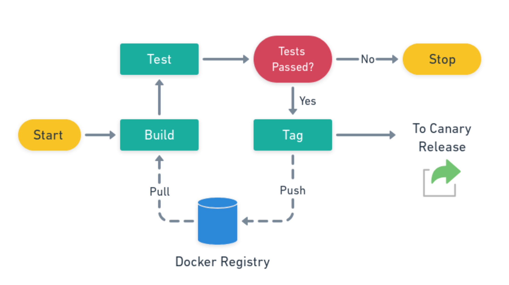

# Kubernetes Resources

## General
Following Network Chuck’s [Intro](https://www.youtube.com/watch?v=7bA0gTroJjw)
- Nodes are the actual cloud instances
- Pods are groups of containers inside a Node

## Setup the K9s cluster on DigitalOcean
- Get the master up on the “Kubernetes” panel
- You will select how many nodes you want and associate it to that master
- Then download the `kubeconfig.yaml` and do `export KIBECONIFG=kubeconfig.yaml`

## Minikube
- [Tutorial](https://kubernetes.io/docs/tutorials/hello-minikube/)
- Install minikube: `brew install minikube` on Mac and `choco install minikube` on Windows
- Start the dashboard: `minikube dashboard`
- Get all the info: `kubectl get all`
- Create a deployment: `kubectl create deployment hello-node --image=k8s.gcr.io/echoserver:1.4`
- View the deployment: `kubectl get deployments`
- Check nodes: `kubectl get nodes`
- Check the cluster info: `kubectl cluster-info`

## Basics
The basic components of Kubernetes are pods, deployment and services.

### Pods
Pods are sets of one to many containers that runs on the same machine and can share a few things together. The containers inside a pod can communicate internally with each other using `localhost`.

- To run one container in a pod we do `kubectl run {nameofpod} -- image={docker-image:version} --port=80`. This will create a pod with an instance of that image with the internal port it will run on
   - For example: `kubectl run web --image=nginx`
- To check the status of the pods: `kubectl get pods`
- To check the details of the pods: `kubectl describe pods`
- To access a pod network from your machine, forward a port with port-forward, for instance: `$ kubectl port-forward <pod-name> 8080:80`
- To delete a pod: `kubectl delete pod {podname]`
- Here's a file that describes a pod:
```yml
# pod-nginx.yml
# Create it with:
# kubectl apply -f pod-nginx.yml
apiVersion: v1
kind: Pod
metadata:
  name: web
spec:
  containers:
  - image: nginx
    name: nginx
    ports:
    - containerPort: 80
    name: http
```

### Declarative vs Imperative Systems
Kubernetes is an imperative system, which means you don't give it direct orders (like Docker Compose) but rather you tell it guidelines of what you want and Kubernetes does it for you.

The basic construct of this are replica sets. Instead of saying: "Create this pod" and then you manually copying and pasting these pods, you tell K8s "I want 30 copies of this pod" and k8s will not only manage in which nodes to create them, but also make sure they're responding to requests and if one fails, automatically take it down and spin a new one. 

### A Replica Set
You can define a replica set like this:
```yml
# pod-replicas.yml
apiVersion: apps/v1
kind: ReplicaSet
metadata:
  name: web-replicas
  labels:
    app: web
    tier: frontend
spec:
  replicas: 3
  selector:
    matchLabels:
      tier: frontend
  template:
    metadata:
      labels:
        app: web
        tier: frontend
    spec:
      containers:
      - name: nginx
        image: nginx
        ports:
        - containerPort: 80
```

### Deployments
In order to drive the CI/CD pipeline and to do clean upgrades/downgrades of those jobs, K8s has the construct of a deployment. It looks a lot like replicas, but has some other parameters.

- To run one deployment, you can do: `kubectl create deployment web --image=nginx`

Deployments can be described in a file. The file is called a manifest:
```yml
# deployment-nginx.yml
apiVersion: apps/v1
kind: Deployment
metadata:
  name: web
spec:
  selector:
    matchLabels:
      app: nginx
  replicas: 3
  template:
    metadata:
      labels:
        app: nginx
    spec:
      containers:
      - name: nginx
        image: nginx:1.7.9
        ports:
        - containerPort: 80
```
The important thing to note is that deployments don't create pods directly -- they delegate that work to one or more replica sets. When you create a deployment, it creates a replica set using the exact pod specs you gave it.

- To deploy you do `kubectl apply -f deployment-nginx.yaml`
- To see deployments `kubectl get deployments`
- You can edit the deployment by doing `kubectl edit deployment {deployment-nginx.yaml}` and it will update the pods

When you update the pod specification itself the deployment creates a new replica set with the updated pod specifications. That replica set has an initial size of zero. Then the size of that replica set is progressively increase, while decreasing the size of the older replica set.
- To edit the deployment you do `kubectl edit deployment-nginx.yaml` 

Kubernetes can detect a broken deployment with readiness probes that can be done with any of the following:
- Running a command inside a container
- Making an HTTP(s) request a against a container
- Opening a TCP socket inside a container

We can also control the number of pods that will taken online and offline using two paramentes: `MaxSurge` and `MaxUnavailable`. By default this is set to 25%, i.e. in a cluster of 100 pods, 25 are immediately created and 25 are inmediately shutdown and then one by one a new one is started while an old one is shutdown until it reaches 100.

#### Quick Demo
You can see things happening real time by opening different terminals with the following:
- kubectl get pods -w
- kubectl get replicasets -w
- kubectl get deployments -w
- kubectl get events -w

Then create, scale and update a deployment with:
- `kubectl create deployment web --image=nginx`
- `kubectl scale deployment web --replicas=10`
- `kubectl set image deployment web nginx=that-image-does-not-exist`

You can see that the deployment is stuck, but 80% of the application’s capacity
is still available.

If you run `kubectl rollout undo deployment web`, Kubernetes will go back
to the initial version, running the nginx image.

### Selectors and Labels
Replica sets don't care about container specs, they only care about their labels. I.e. it doesn't matter if a pod is running `nginx` or `redis`, they only thing that matters is that they have the right labels.

A replica set contains a `selector` that is like a SQL `SELECT` query.

### Service
Selectors are also used by `services` which act as load balancers of Kubernetes traffic, internal and external.

You can create a service for the web deploment using this command:
`kubectl expose deployment web --port=80`

The service will have its own internal IP address (denoted by the name ClusterIP), and connections to this IP address on port 80 will be load-balanced across all the pods matching the service’s selector. In that case, that selector will be run=web..

When you edit the deployment and trigger a rolling update, a new replica set is created. This replica set will create pods, whose labels will include, among others, run=web. As such, these pods will receive connections automatically.

Services are closely related to the hosting provider, since they usually create an actual cloud load balancer. Here's an example service that's specific for Linode:
```yml
apiVersion: v1
kind: Service
metadata:
  name: web-service
  annotations:
    service.beta.kubernetes.io/linode-loadbalancer-throttle: "4"
  labels:
    app: web-service
spec:
  type: LoadBalancer
  ports:
  - name: http
    port: 80
    protocol: TCP
    targetPort: 80
  selector:
    app: web
  sessionAffinity: None
```
- To get services do `kubectl get services`

# CI/CD 
An end-to-end CI test should take 10 minutes at most, otherwise developers can start context switching.

## Docker Commands
A Docker registry stores Docker images. Docker CLI provides the following commands for managing images:
- `push` and `pull`: these commands work like in Git. We can use them to transfer images to and from the registry.
- `login`: we need to log in before we can push images. Takes a username, password, and an optional registry URL.
- `build`: creates a custom image from a Dockerfile.
- `tag`: renames an image or changes its tag.
- `exec`: starts a process in an already-running container. Compare it with docker run which starts a new container instead.

## KubeCTL Commands
Kubectl is the primary admin CLI for Kubernetes. We’ll use the following commands during deployments:
- `get service`: this shows what services are running in a cluster. For instance, we can check the status and external IP of a load balancer.
- `get events`: shows recent cluster events.
- `describe`: shows detailed information about services, deployments, nodes, and pods.
- `logs`: dumps a container’s stdout messages.
- `apply`: starts a declarative deployment. Kubernetes compares the current and target states and takes the necessary steps to reconcile them.
- `rollout status`: shows the deployment progress and waits until the deployment finishes.
- `exec`: works like docker exec, executes a command in an already running pod.
- `delete`: stops and removes pods, deployments, and services.
- Clusters Management
  - You can have one or more clusters to manage. Tjey are grouped by "contexts". They are saved in a config file inside `~/.kube/config`
    - To see all contexts: `config get-contexts`
    - To see current selected context: `config current-context`
    - To change context: `config use-context {context-name}`
    - To get all clusters `config get-clusters`
    - For more commands do `kubectl config --help`
    

## General Flow
This is the general flow of a CI/CD workflow:



### Build
First, we need to checkout the Github repo and then build the Docker Image and push it.

We do a pull of the latest image pull. We then push a temporary image tagged with the workflow id of whatever tool we use.

These are the general steps:
```
checkout
docker login -u $USERNAME -p $PASSWORD $REGISTRY_URL 
docker pull $REGISTRY_URL/ffk-service-admin:latest || true
docker build -t $REGISTRY_URL/ffk-service-admin:$WORKFLOW_ID . 
docker push $REGISTRY_URL/ffk-service-admin:$WORKFLOW_ID
```

### Test
Then we need to run tests. We could have static tests (Lint), Functional tests (can we connect to the database) and Integration tests (do processes with a database).

A static test would be run with this:
```
docker run -it $REGISTRY_URL/ffk-service-admin:$WORKFLOW_ID npm run lint
```

The functional test would be something like this:
```
service start postgres 
docker run --net=host -it $REGISTRY_URL/ffk-service-admin:$WORKFLOW_ID npm run ping
docker run --net=host -it $REGISTRY_URL/ffk-service-admin:$WORKFLOW_ID npm run migrate
```
This tests if we can ping the database and runs a migration.

Finally the integration test would be:
```
service start postgres 
docker run --net=host -it $REGISTRY_URL/ffk-service-admin:$WORKFLOW_ID npm run test
```

### Push
We're now ready to push the container to the K8s environment (or cluster). We need to 

# Github Actions

## Actions Marketplace
- [Digital Ocean doctl](https://github.com/digitalocean/action-doctl)
- [Digital Ocean Kubernetes](https://github.com/marketplace/actions/digitalocean-kubernetes)

## Digital Ocean Docker Registry
Here's an example using `doctl` to push an image to their registry:
```yaml
env:
  REGISTRY: "registry.digitalocean.com/your_registry"
  IMAGE_NAME: "image_name"

  COMMAND: "python main.py"

jobs:
  test:
    runs-on: ubuntu-latest

    steps:
      - name: Checkout master
        uses: actions/checkout@v2

      - name: Set up Python 3.8
        uses: actions/setup-python@v2
        with:
          python-version: 3.8

      - name: Install dependencies with pipenv
        run: |
          python -m pip install --upgrade pip
          pip install pipenv
          if [ -f Pipfile ]; then pipenv install --deploy --dev; fi

      - name: Lint with flake8
        run: |
          # stop the build if there are Python syntax errors or undefined names
          pipenv run flake8 . --count --select=E9,F63,F7,F82 --show-source --statistics
          # exit-zero treats all errors as warnings. The GitHub editor is 127 chars wide
          pipenv run flake8 . --count --exit-zero --max-complexity=10 --max-line-length=127 --statistics

      - name: Test with pytest
        run: |
          pipenv run pytest .
  
  build_and_push:
    runs-on: ubuntu-latest
    if: github.event_name == 'push'
    needs: test

    steps:
      - name: Checkout master
        uses: actions/checkout@v2

      - name: Build container image
        run: docker build -t $(echo $REGISTRY)/$(echo $IMAGE_NAME):$(echo $GITHUB_SHA | head -c7) .

      - name: Install doctl
        uses: digitalocean/action-doctl@v2
        with:
          token: ${{ secrets.DIGITALOCEAN_ACCESS_TOKEN }}

      - name: Log in to DigitalOcean Container Registry with short-lived credentials
        run: doctl registry login --expiry-seconds 600

      - name: Push image to DigitalOcean Container Registry
        run: docker push $(echo $REGISTRY)/$(echo $IMAGE_NAME):$(echo $GITHUB_SHA | head -c7)

  deploy:
    runs-on: ubuntu-latest
    if: github.event_name == 'push'
    needs: build_and_push

    steps:
      - name: Deploy to Digital Ocean droplet via SSH action
        uses: appleboy/ssh-action@v0.1.3
        with:
          HOST: ${{ secrets.HOST }}
          USERNAME: ${{ secrets.USERNAME }}
          KEY: ${{ secrets.SSHKEY }}
          envs: IMAGE_NAME,REGISTRY,GITHUB_SHA,COMMAND
          script: |
            # Stop running container
            docker stop $(echo $IMAGE_NAME)

            # Remove old container
            docker rm $(echo $IMAGE_NAME)

            # Run a new container from a new image
            docker run -d \
            --restart always \
            --env-file .env \
            -p 8000:8000 \
            --name $(echo $IMAGE_NAME) \
            $(echo $REGISTRY)/$(echo $IMAGE_NAME):$(echo $GITHUB_SHA | head -c7) $(echo $COMMAND)
 ```

# Appendix
## Google GKE 
- [Google GKE Github Actions](https://github.com/GoogleCloudPlatform/github-actions/tree/master/example-workflows/gke)

## Flask Celery Kubernetes
- [Check here](https://github.com/matiaslindgren/celery-kubernetes-example)

## FM Model repo
- [Check here](https://github.com/findmine/services/tree/d1e98ec652c3c560b4f7b90c5d70d1069e814fd5)
